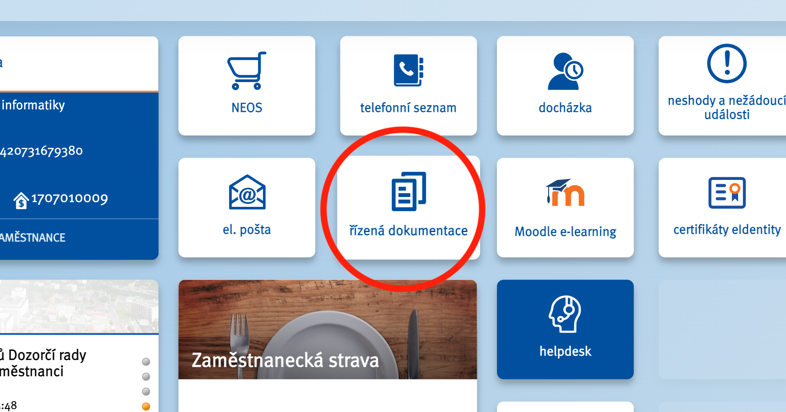

# Dokumentace k portálu UCP

TODO: Dozvíte se co je to UCP. Z čeho všeho se skláda. atd.

## Modul Řízená dokumentace
TODO: Co to je proč to je, jak to je 

Do řízené dokumentace se dostanete přes [rozcestník](http://rozcestnikkz.kzcr.eu/) KZ a.s. , a to klikem na kartu "řízená dokumentace".

V případě potřeby využijte návodu pro řízenou dokumentaci [zde](./rd/index.md).

## Modul Plánování služeb

## Modul Zdravotechnika
