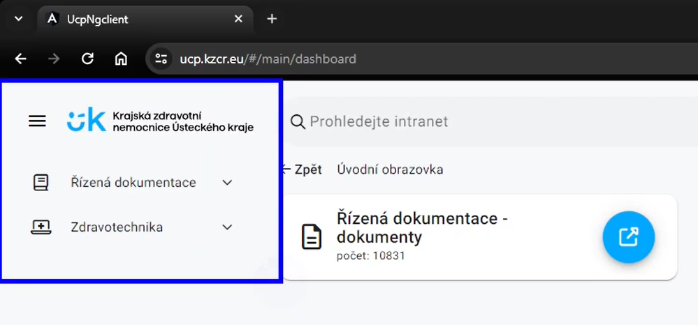
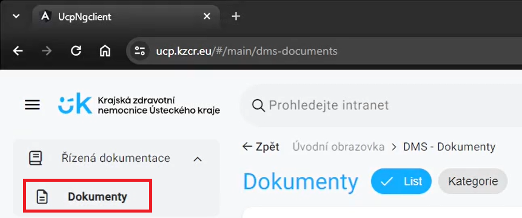
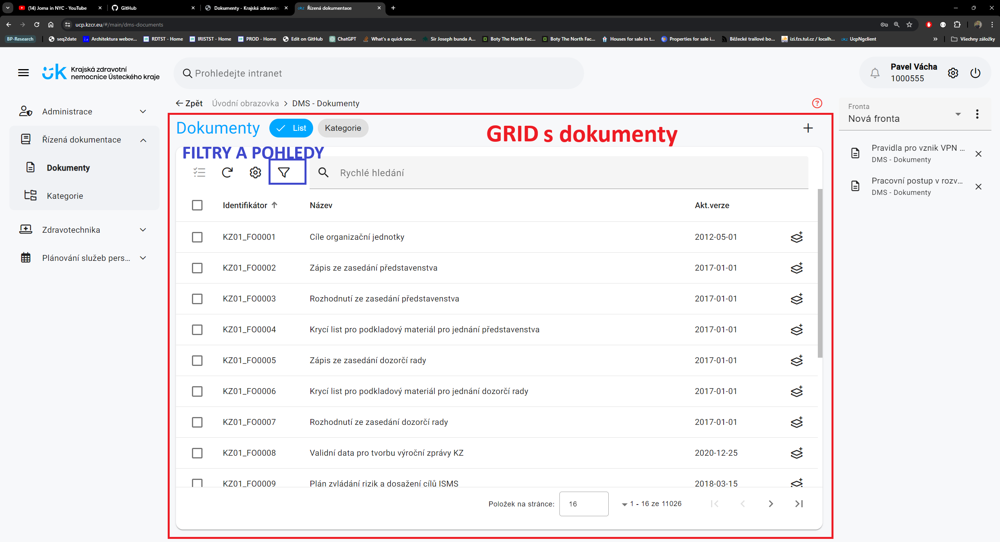
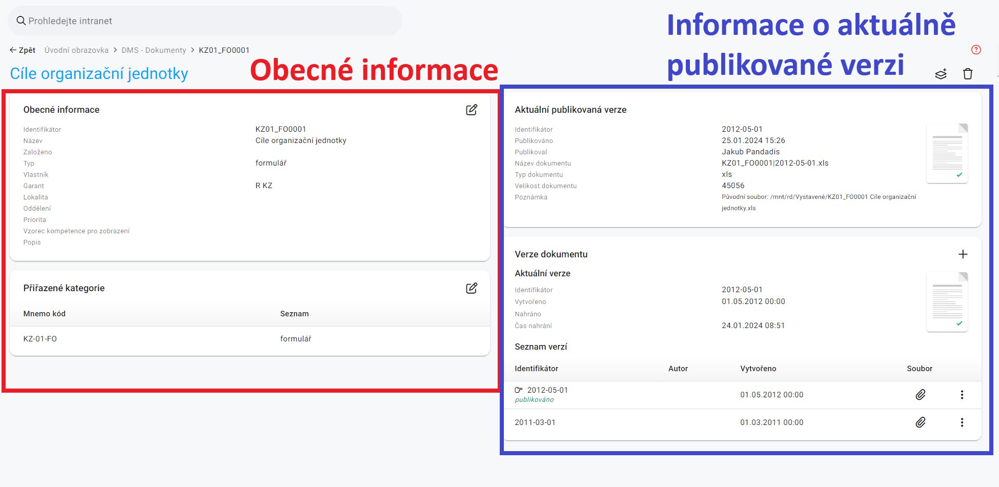
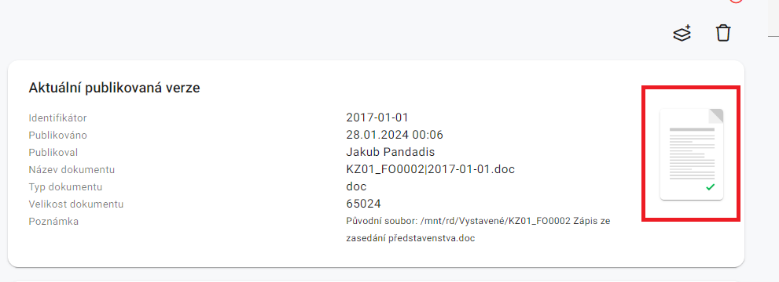
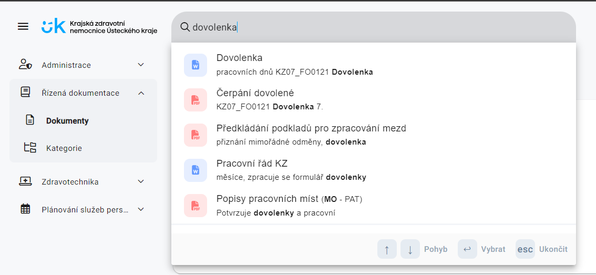
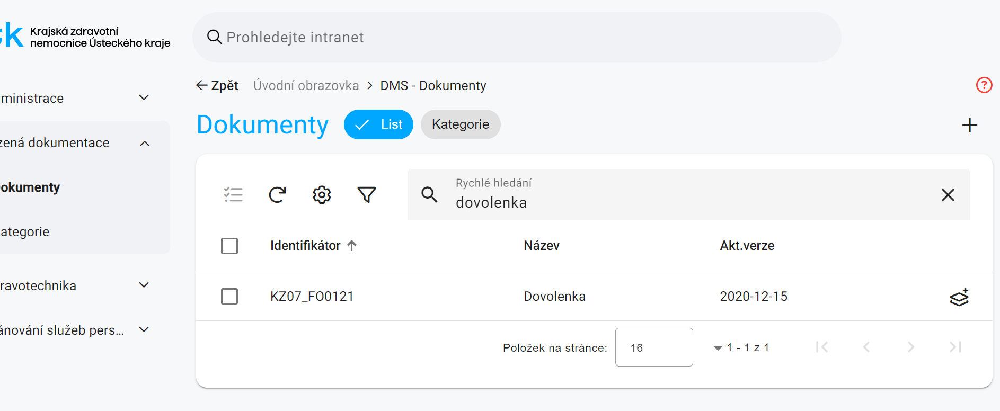
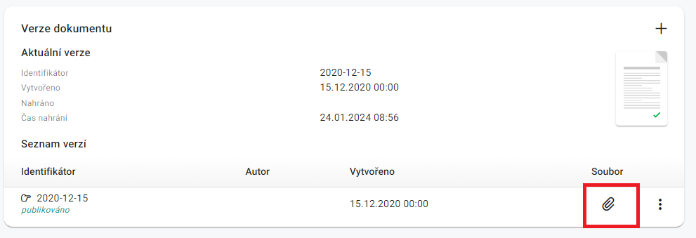

## Jak se do této sekce dostanu?
Po přihlášení se vám zobrazí základní nabídka. V levé straně uvidíte základní menu, ve kterém bude záložka **"Řízená dokumentace"**. Toto lévé základní menu zůstavá po celou dobu práce v UCP viditelné.

1. Klikněte na záložku **"Řízená dokumentace"** v menu.
2. Rozbalí se Vám na stejném místě další nabídka.
3. V rozbalené nabídce vyberte položku **"Dokumenty"**.

Po kliknutí se dostanete na základní zobrazení řízené dokumentace. Ta obsahuje takzvaný **grid** neboli **hlavní zobrazovací plochu**, ve které najdete již samotné záznamy s dokumenty.

## Detail dokumentu

Po nalezení hledaného dokumentu a následném kliknutí na položku v seznamu se dostanete do detailu dokumentu.

**Hlavní zobrazovací plocha** se skládá ze dvou částí. Část vlevo popisuje obecné informace o dokumentu. Část vpravo popisuje poslední aktuální publikovaný dokument spolu s přílohou, datumem publikace a cestou k dokumentu a jeho typ. Vpravé části lze také nalézt seznam všech verzí, ve které se dokument nacházel.

### Aktuální publikovaná verze dokumentu

V detailu položky najdete v poli Aktuální publikovaná verze detailní informace o právě platném vystaveném dokumentu. Kliknutím na ikonu s přílohou se dokument buď v případě, že se jedná o pdf formát rovnou otevře nebo bude stažen na lokální disk, kde si jej můžete pomocí příslušného programu otevřít.

## Jak mohu najít konkrétní dokument?
Pokud znáte část názvu nebo identifikační číslo dokumentu, existují dvě možnosti. **"Prohledávání skrz intranet"** a **"Rychlé vyhledávání v seznamu".** První z možností prohledává mimo řízené dokumentace i v dokumentech pro zdravotechniku či pasportizaci. Rychlé vyhledávání vyhledává pouze v řízené dokumentaci.

### Prohledávání skrz intranet
V horní části okna je vyhledávací pole s textem **"Prohledejte intranet"**. Pro vyhledání dokumentu je postup následující:

1. Zadejte do vyhledávacího pole hledaný výraz.
3. Zobrazil se vám seznam s dokumenty.
4. Dokument vyberte kliknutím. 

### Rychlé vyhledávání v seznamu
Pole pro rychlé vyhledávání se nachází v seznamu dokumentů po kliknutí na záložku **"Dokumenty"**.

1. Zadejte do vyhledávacího pole hledaný výraz.
2. Stiskněte klávesu Enter.
3. Zobrazil se vám seznam s dokumenty.
4. Dokument vyberte kliknutím. 

## Jaký je rozdíl mezi rychlým vyhledáváním a filtrací dokumentů?

Rychlé vyhledávání umožňuje rychlý přístup k dokumentům na základě jejich názvu nebo identifikačního čísla. Filtrace poskytuje pokročilejší možnosti vyhledávání, jako je filtrování podle různých kritérií jako jsou oddělení nebo lokalita. 

V případě nejasností při práci s filtry využijte návod pro [filtry a pohledy](filtry_pohledy.md).

## Jak můžu stáhnout starší verzi dokumentu?

V detailu dokumentu klikněte na ikonku spony. Dokument se sám stáhne.

