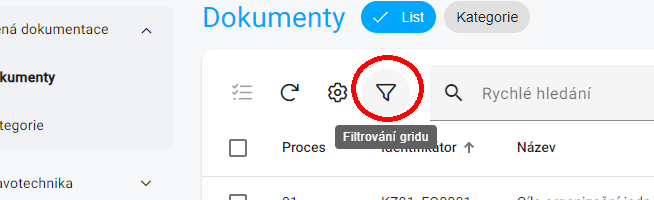
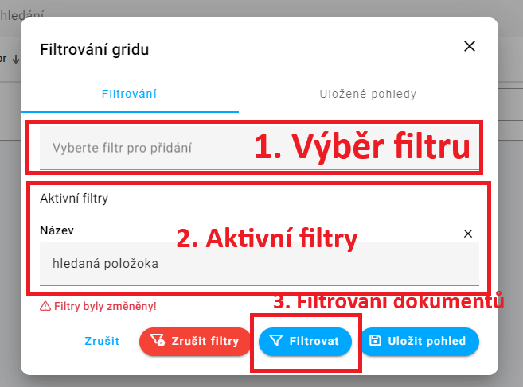
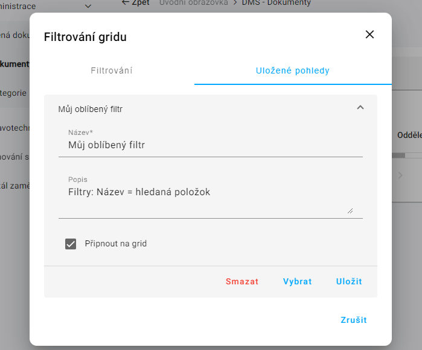
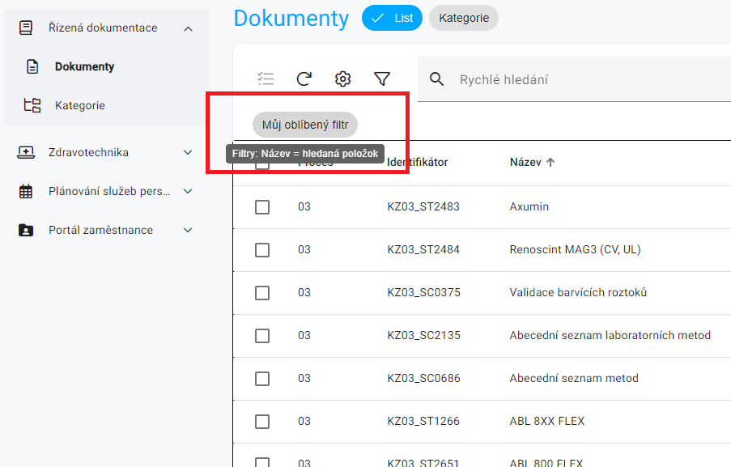

## Filtry a pohledy

* `Filtr` je nástroj pro hledání pomocí vlastností dokumentů.
* `Pohled` jeden nebo více zkombinovaných filtrů uložených pro rychlý přístup.

## Jak se do sekce Filtry dostanu?
Předpokládá se, že jste v sekci **Řízená dokumentace** a máte otevřenou záložku **Dokumenty**.

1. Klikněte na trychtýř, nacházející se v levé vrchní části zobrazení, hned nalevo od „Rychlého vyhledávání“.
2. Otevře se Vám modální okno s dvěma záložkami "filtrování" a "uložené pohledy", dále výběrovým polem nazvaným "Vyberte filtr pro přidání" a seznamem aktivních filtrů.

## Filtrace pomocí vlastností dokumentu
Předpokládá se, že jste v sekci **Filtry**. 

1. Klikněte na pole "Vyberte filtry pro přidání".
2. Objeví se seznam položek, podle kterých lze filtry vytvářet.
3. Vyberte položku, podle které chcete filtrovat.
4. V Části "Aktivní filtry" se objeví textové pole s názvem vybraného filtru.
5. Zadejte do textového pole hledaný výraz.
6. Klikněte na tlačítko **Filtrovat**.

!!!- info "Tip - více filtrů"
    Přidání dalšího filtru probíhá kliknutím opět na políčko "Vyberte filtr pro přidání" a celý proces **Filtrace pomocí vlastností dokumentu** opakovat s tím, že již budete filtrovat dle více položek, což bude vidět v části "Aktivní filtry", kde vám přibude další vámi vybrané textové pole s názvem vybraného filtru.

## Uložení pohledu
Předpokládá se, že jste v sekci **Filtry**. 

1. Nastavte si svoje filtry, dle postupu výše.
2. Klikněte na tlačítko vpravo dole **Uložit pohled**.
3. Zobrazí se sekce **"Uložené pohledy"** a textové pole s názvem.
4. Zadejte do textového pole název pohledu. (např. `můj oblíbený filtr`)
5. Klikněte na tlačítko Uložit. 

## Výběr pohledu
Předpokládá se, že jste v sekci **Řízená dokumentace** a máte otevřenou záložku **Dokumenty**.

1. Klikněte na tlačítko s hledaným pohledem, nachází se nad prvním dokumentem v seznamu.

